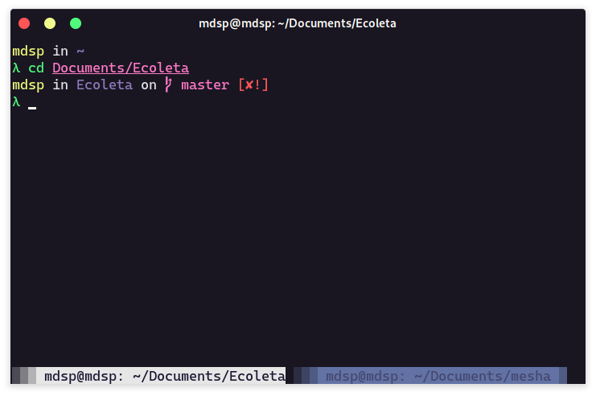

# Omni for [Kitty](https://sw.kovidgoyal.net/kitty/)

<div align="center" width="30%">
  
</div>

## [Install](https://github.com/Mdsp9070/kitty-omni/blob/master/INSTALL.md)

#### Install using config file

Clone this repo

```sh
  git clone https://github.com/Mdsp9070/kitty-omni ~
```

Include omni.conf under your kitty.conf

```sh
  echo "include omni.conf" >> ~/.config/kitty/kitty.conf
```

#### Activating theme

1. Restart Kitty

## Tips

The screenshot shown is a combination of the following additional software:

- [Oh My Zsh](https://github.com/robbyrussell/oh-my-zsh)
- [zsh-syntax-highlighting](https://github.com/zsh-users/zsh-syntax-highlighting)

## License

[MIT License](https://github.com/Mdsp9070/kitty-omni/blob/master/LICENSE)
